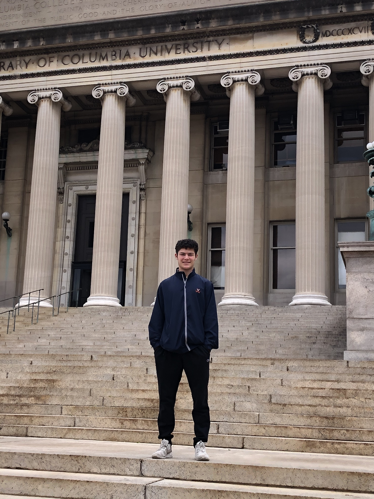

## ________________________________________________________________________

 
 
 
 
 
 

I am currently enrolled in the MS in Computer Science program at Columbia University in NYC, concentrating in machine learning. I received a BA in Statistics and Computer Science from the University of Virginia (UVA) in May 2021.

During my time at UVA, I served as CFO for The Cavalier Daily, the student-run, financially-independent news organization at the university. I also worked as a research fellow for Research for Sustainable Commerce, a customer analytics group that partners with and studies local and non-local businesses dedicated to improving their social and environmental impact.

<blockquote>
*I am actively seeking an entry-level position in the areas of software engineering, data science and quantitative research. Please reach out if you know of any such opportunities or if you would simply like to connect!*

<a href="https://www.linkedin.com/in/malcolm-mashig/" target="_blank">LinkedIn</a> | <a href="https://twitter.com/MalcolmMashig" target="_blank">Twitter</a> | <a href="https://github.com/MalcolmMashig" target="_blank">GitHub</a>

m.mashig@columbia.edu | 201-753-1240
</blockquote>

Please find my resume, transcript and statement of purpose within [Resume+](https://malcolm-mashig.netlify.app/resume.html), selected course projects within [Course Projects](https://malcolm-mashig.netlify.app/coursework.html) and other selected works of mine within [Other Projects](https://malcolm-mashig.netlify.app/other-projects.html).

*This website was built with R Markdown and is hosted by Netlify. Code and files for the site can be found on its synced <a href="https://github.com/MalcolmMashig/portfolio-website" target="_blank">GitHub repository</a>.*

 

